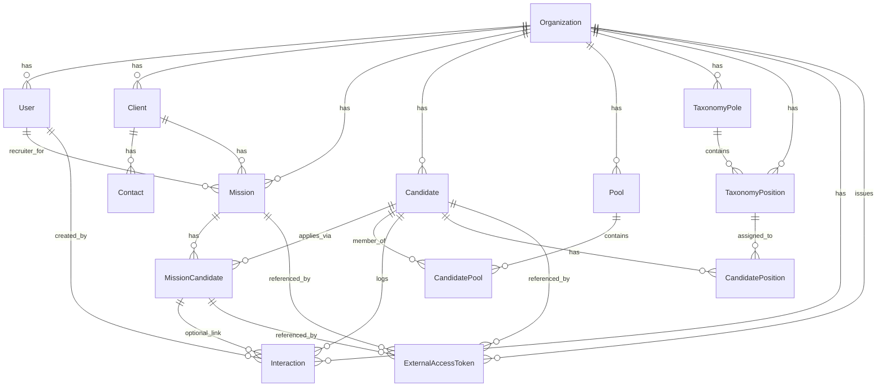

# ORCHESTR Database Logic

This document describes the database architecture, entity definitions, relationships, and access control model for the ORCHESTR recruitment platform.

## Overview

The ORCHESTR database is organized around three interconnected graphs:

1. **People Graph**: Candidates (persons), their taxonomy classification (poles, positions), relationship maturity, and pool memberships
2. **Client and Missions Graph**: Clients, recruitment missions, applications (candidate-mission associations), and interaction logs
3. **Users and Access Graph**: Internal users, organization membership, and external access tokens for portals

All domain data is multi-tenant, scoped by `organizationId` and enforced through Row Level Security (RLS).

## Entity Relationship Diagram



## Entity Definitions

### Core Entities

#### Organization

The top-level tenant entity. All data belongs to exactly one organization.

| Field | Type | Description |
|-------|------|-------------|
| id | cuid | Primary key |
| name | string | Organization name |
| createdAt | timestamp | Creation timestamp |
| updatedAt | timestamp | Last update timestamp |

#### User

An internal user (recruiter, admin) belonging to an organization.

| Field | Type | Description |
|-------|------|-------------|
| id | cuid | Primary key |
| organizationId | string | FK to Organization |
| authUserId | uuid | Links to Supabase auth.uid() for RLS |
| email | string | Unique email address |
| name | string | Display name |
| role | enum | ADMIN or RECRUITER |

#### Candidate (Person)

A unique person within an organization's talent database. The central entity of the People Graph.

| Field | Type | Description |
|-------|------|-------------|
| id | cuid | Primary key |
| organizationId | string | FK to Organization |
| firstName | string | First name |
| lastName | string | Last name |
| email | string | Primary email (nullable, unique per org) |
| phone | string | Primary phone (nullable) |
| profileUrl | string | LinkedIn or other profile URL (nullable) |
| relationshipLevel | enum | Global relationship maturity |
| status | enum | ACTIVE, TO_RECONTACT, BLACKLIST, DELETED |

**Important**: A Candidate can exist without any interactions or mission associations. The `relationshipLevel` is a global measure of how mature the relationship is between the organization and this person, independent of any specific mission.

### Taxonomy Entities

#### TaxonomyPole

Organization-specific job function categories (e.g., Sales, Engineering, Operations).

| Field | Type | Description |
|-------|------|-------------|
| id | uuid | Primary key |
| organizationId | string | FK to Organization |
| name | string | Pole name (unique per org) |

#### TaxonomyPosition

Specific job positions within a pole (e.g., Business Developer within Sales).

| Field | Type | Description |
|-------|------|-------------|
| id | uuid | Primary key |
| organizationId | string | FK to Organization |
| poleId | uuid | FK to TaxonomyPole |
| name | string | Position name (unique per org) |

#### CandidatePosition (Join Table)

Associates candidates with multiple positions (many-to-many).

| Field | Type | Description |
|-------|------|-------------|
| id | uuid | Primary key |
| candidateId | string | FK to Candidate |
| positionId | uuid | FK to TaxonomyPosition |

**Note on Seniority**: For MVP, seniority is stored as a simple enum field on Candidate (`estimatedSeniority`) using the existing `Seniority` enum (JUNIOR, MID, SENIOR, LEAD, EXECUTIVE). To support multiple seniority levels per candidate in the future, add a `CandidateSeniority` join table similar to `CandidatePosition`.

### Pool Entities

#### Pool

A segmented sub-database for organizing candidates for sourcing purposes.

| Field | Type | Description |
|-------|------|-------------|
| id | cuid | Primary key |
| organizationId | string | FK to Organization |
| name | string | Pool name (unique per org) |
| description | string | Optional description |

#### CandidatePool (Join Table)

Associates candidates with pools (many-to-many).

| Field | Type | Description |
|-------|------|-------------|
| id | cuid | Primary key |
| candidateId | string | FK to Candidate |
| poolId | string | FK to Pool |
| addedAt | timestamp | When the candidate was added |

**Pools vs Taxonomy**: Pools are for operational grouping (e.g., "Q1 2024 Tech Sourcing"), while taxonomy is for classification (e.g., "Senior Backend Engineer"). A candidate can be in multiple pools and have multiple positions.

### Client and Mission Entities

#### Client

A company account that commissions recruitment missions.

| Field | Type | Description |
|-------|------|-------------|
| id | cuid | Primary key |
| organizationId | string | FK to Organization |
| name | string | Company name |
| sector | string | Industry sector (optional) |
| website | string | Company website (optional) |

#### Contact

A person at a client company.

| Field | Type | Description |
|-------|------|-------------|
| id | cuid | Primary key |
| clientId | string | FK to Client |
| name | string | Contact name |
| email | string | Contact email (optional) |
| phone | string | Contact phone (optional) |
| role | string | Job title (optional) |

#### Mission

A recruitment mission/job belonging to a client.

| Field | Type | Description |
|-------|------|-------------|
| id | cuid | Primary key |
| organizationId | string | FK to Organization |
| clientId | string | FK to Client |
| title | string | Job title |
| status | enum | DRAFT, ACTIVE, ON_HOLD, CLOSED_FILLED, CLOSED_CANCELLED |

### Application and Interaction Entities

#### MissionCandidate (Application)

The bridge entity linking a Candidate to a Mission. Represents an "application" or candidacy.

| Field | Type | Description |
|-------|------|-------------|
| id | cuid | Primary key |
| missionId | string | FK to Mission |
| candidateId | string | FK to Candidate |
| stage | enum | Pipeline stage (SOURCED through CLOSED_HIRED/REJECTED) |
| score | int | AI-generated match score (optional) |

**Constraint**: Unique on (missionId, candidateId) ensures one application per candidate per mission.

#### Interaction

An event log entry linked to a Candidate and optionally to a specific MissionCandidate.

| Field | Type | Description |
|-------|------|-------------|
| id | cuid | Primary key |
| organizationId | string | FK to Organization (for RLS) |
| candidateId | string | FK to Candidate (required) |
| missionCandidateId | string | FK to MissionCandidate (nullable) |
| userId | string | FK to User who created it (nullable) |
| type | enum | MESSAGE, EMAIL, CALL, INTERVIEW_SCHEDULED, etc. |
| content | string | Interaction details (optional) |

**Design Note**: `organizationId` is denormalized on Interaction for efficient RLS enforcement. It must always match the Candidate's organizationId.

### Access Token Entity

#### ExternalAccessToken

Hashed tokens for external portal access (candidate or client portals).

| Field | Type | Description |
|-------|------|-------------|
| id | uuid | Primary key |
| organizationId | string | FK to Organization |
| tokenType | enum | CANDIDATE_PORTAL or CLIENT_PORTAL |
| tokenHash | string | SHA-256 hash (unique) |
| expiresAt | timestamp | Expiration time |
| revokedAt | timestamp | Revocation time (nullable) |
| missionId | string | FK to Mission (for CLIENT_PORTAL) |
| missionCandidateId | string | FK to MissionCandidate (for CANDIDATE_PORTAL) |
| candidateId | string | FK to Candidate (optional direct reference) |

**Security**: Only the hash is stored, never the raw token. Token validation happens server-side using service role, not through RLS.

## Cardinalities

| Relationship | Cardinality | Description |
|--------------|-------------|-------------|
| Organization to User | 1:N | One org has many users |
| Organization to Candidate | 1:N | One org has many candidates |
| Organization to Client | 1:N | One org has many clients |
| Organization to Mission | 1:N | One org has many missions |
| Organization to Pool | 1:N | One org has many pools |
| Organization to TaxonomyPole | 1:N | One org has many poles |
| TaxonomyPole to TaxonomyPosition | 1:N | One pole has many positions |
| Candidate to TaxonomyPosition | N:M | Via CandidatePosition join |
| Candidate to Pool | N:M | Via CandidatePool join |
| Candidate to Mission | N:M | Via MissionCandidate join |
| Mission to Client | N:1 | Many missions per client |
| Candidate to Interaction | 1:N | One candidate has many interactions |
| MissionCandidate to Interaction | 1:N | Optional link |

## Rules of Life

### Candidate Existence

A Candidate can exist in the database without any interactions or mission associations. This allows for:
- Importing candidates from external sources before any contact
- Building talent pools proactively
- Tracking people who have been identified but not yet approached

### Relationship Level Progression

The `relationshipLevel` on Candidate is a global indicator of relationship maturity:

1. **SOURCED**: Initial discovery, candidate identified but not contacted
2. **CONTACTED**: First outreach made (any channel)
3. **ENGAGED**: Active dialogue established, responding to messages
4. **QUALIFIED**: Skills and fit validated through conversation/interview
5. **SHORTLISTED**: Has been presented to at least one client
6. **PLACED**: Successfully placed in a role

This progression is global, not mission-specific. A candidate may be QUALIFIED overall but at different pipeline stages in different missions.

### Pools vs Taxonomy

| Aspect | Pools | Taxonomy |
|--------|-------|----------|
| Purpose | Operational grouping | Classification |
| Example | "Q1 Tech Sourcing", "AI Engineers for ClientX" | "Senior Backend Engineer", "Sales Lead" |
| Lifespan | Often temporary/project-based | Persistent |
| Usage | Sourcing campaigns | Filtering and matching |

### Application Logic

- A Candidate can apply to multiple Missions via MissionCandidate records
- Each MissionCandidate has its own pipeline stage
- The unique constraint (missionId, candidateId) prevents duplicates
- When a candidate advances in a mission, their global relationshipLevel may also update

### Interaction Logging

- Every interaction is linked to a Candidate (required)
- An interaction may optionally link to a MissionCandidate for mission context
- The organizationId is denormalized for RLS performance
- Interaction types include: MESSAGE, EMAIL, CALL, INTERVIEW_SCHEDULED, INTERVIEW_DONE, NOTE, CLIENT_FEEDBACK, STATUS_CHANGE

## Access Model

### Internal Users

Internal users (recruiters, admins) are authenticated via Supabase Auth. The RLS system uses:

1. `auth.uid()`: The Supabase auth user ID
2. `users.auth_user_id`: Links internal User to Supabase auth
3. `current_org_id()`: Helper function that returns the user's organizationId

All organization-scoped tables enforce:
```sql
organization_id = current_org_id()
```

### External Access Tokens

External portal access uses hashed tokens:

1. Token is generated server-side (random bytes)
2. SHA-256 hash is stored in `external_access_tokens`
3. Raw token is sent to user (email/link)
4. Validation happens server-side with service role (bypasses RLS)
5. Tokens have expiration and can be revoked

Token types:
- **CANDIDATE_PORTAL**: Links to missionCandidateId, allows candidate to view their application
- **CLIENT_PORTAL**: Links to missionId, allows client to view shortlist and provide feedback

**Important**: Portal token validation does NOT use RLS. The service role queries the token table directly, validates the hash, checks expiration/revocation, then returns data for the referenced entity.

## Naming Conventions

| Convention | Example | Notes |
|------------|---------|-------|
| Table names | snake_case plural | `mission_candidates`, `taxonomy_poles` |
| Column names | camelCase | `organizationId`, `createdAt` |
| Enum names | PascalCase | `RelationshipLevel`, `ExternalTokenType` |
| Enum values | SCREAMING_SNAKE | `CANDIDATE_PORTAL`, `CLIENT_PORTAL` |
| Primary keys | `id` | cuid for existing tables, uuid for new tables |
| Foreign keys | `entityId` | `organizationId`, `candidateId`, `missionId` |
| Timestamps | `createdAt`, `updatedAt` | Present on all main tables |

## Extensibility Notes

### Adding New Taxonomy Types

To add a new taxonomy type (e.g., TaxonomySeniorityLevel as a configurable table):

1. Create the new table with `organizationId`, `name`, unique constraint
2. Create a join table linking to Candidate
3. Add RLS policies matching the pattern for existing taxonomy tables

### Multi-Seniority Support

Current: Single `estimatedSeniority` enum on Candidate.

To support multiple seniority levels per candidate:
1. Create `TaxonomySeniorityLevel` table
2. Create `CandidateSeniority` join table
3. Deprecate or repurpose the enum field

### Additional Interaction Types

The `InteractionType` enum can be extended by adding new values. Consider:
- Adding a `metadata` JSON field for type-specific data
- Using separate tables for complex interaction types (e.g., Interview already exists)

### Custom Fields

For organization-specific custom fields:
1. Add a `customFields` JSON column to relevant tables
2. Or create a dedicated `CustomField` and `CustomFieldValue` table structure

## Files Reference

| File | Purpose |
|------|---------|
| `prisma/schema.prisma` | Prisma schema (source of truth) |
| `prisma/migrations/` | Prisma migrations |
| `supabase/policies.sql` | RLS policies and helper functions |
| `docs/database-logic.md` | This documentation |

