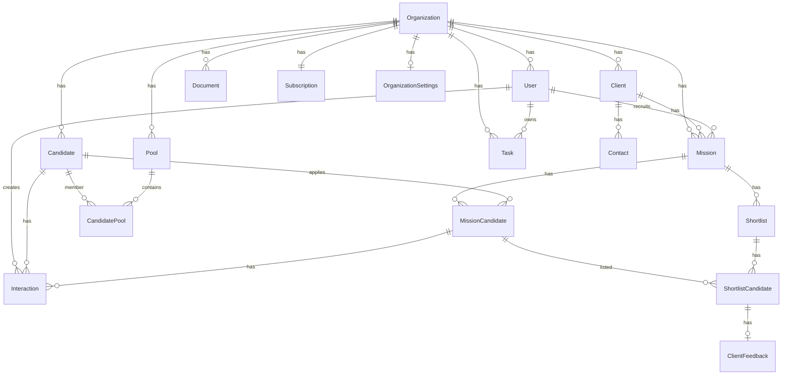

# Database

> Schema, relationships, and entity definitions

---

## Overview

ORCHESTR uses PostgreSQL (via Supabase) with Prisma ORM. **Clean Slate v2** (2026-03) reduced the product schema to **17 tenant-scoped tables**, unified documents, and full Row Level Security on `public`.  
**Source of truth:** [`prisma/schema.prisma`](../prisma/schema.prisma) and [`supabase/policies.sql`](../supabase/policies.sql).  
**Diagnostics:** [`supabase/diagnose.sql`](../supabase/diagnose.sql).

Domains:

1. **Tenant & billing** — organizations, settings, subscriptions, users  
2. **CRM & missions** — clients, contacts, missions, mission candidates, shortlists, client feedback  
3. **Talent** — candidates, pools, interactions, tasks, documents  

Removed from the ORM (no longer in Prisma): taxonomy poles/positions, questionnaires, interviews, events, separate enrichment table, legacy CSV/import-only tables.

---

## Entity relationship (Clean Slate v2)



### Table list (public, app)

| Table | Prisma model |
|-------|----------------|
| `organizations` | Organization |
| `organization_settings` | OrganizationSettings |
| `subscriptions` | Subscription |
| `users` | User |
| `clients` | Client |
| `contacts` | Contact |
| `missions` | Mission |
| `candidates` | Candidate |
| `mission_candidates` | MissionCandidate |
| `pools` | Pool |
| `candidate_pools` | CandidatePool |
| `interactions` | Interaction |
| `tasks` | Task |
| `documents` | Document |
| `shortlists` | Shortlist |
| `shortlist_candidates` | ShortlistCandidate |
| `client_feedbacks` | ClientFeedback |

**UI field note:** clients use `companyName` (not `name`). Filters or saved views using `client.name` are mapped to `companyName` in [`src/lib/filters/filter-engine.ts`](../src/lib/filters/filter-engine.ts).

---

> **Legacy doc:** Sections below still describe older entities (taxonomy, enrichment, questionnaires, etc.) for historical context and may not match the current schema. Prefer `prisma/schema.prisma` when in doubt.

---

## Core Entities

### Organization

The top-level tenant entity. All data belongs to exactly one organization.

```prisma
model Organization {
  id                    String   @id @default(cuid())
  name                  String
  logo                  String?
  contactEmail          String?
  defaultCalendlyLink   String?
  retentionDaysIgnored  Int      @default(90)
  retentionDaysActive   Int      @default(365)
  onboardingCompleted   Boolean  @default(false)
  createdAt             DateTime @default(now())
  updatedAt             DateTime @updatedAt

  users                 User[]
  clients               Client[]
  missions              Mission[]
  candidates            Candidate[]
  pools                 Pool[]
  events                Event[]
  subscription          Subscription?
  settings              OrganizationSettings?
  // ... other relations
}
```

### OrganizationSettings

Organization-scoped configurable lists for candidate management (1:1 with Organization).

| Field | Type | Description |
|-------|------|-------------|
| `id` | cuid | Primary key |
| `organizationId` | string | FK to Organization (unique) |
| `domains` | string[] | Ex: Leasing, Crédit Conso, IT, M&A |
| `sectors` | string[] | Ex: Courtier, Captive, Asset Management |
| `jobFamilies` | string[] | Ex: Commercial, Manager, Direction |

### User

An internal user (recruiter, admin) belonging to an organization.

| Field | Type | Description |
|-------|------|-------------|
| `id` | cuid | Primary key |
| `organizationId` | string | FK to Organization |
| `authUserId` | uuid | Links to Supabase auth.uid() for RLS |
| `email` | string | Unique email address |
| `name` | string | Display name |
| `role` | enum | `ADMIN` or `RECRUITER` |
| `linkedinConnected` | boolean | LinkedIn integration status |

### Subscription

Billing and plan information for an organization.

| Field | Type | Description |
|-------|------|-------------|
| `stripeCustomerId` | string | Stripe customer ID |
| `stripeSubscriptionId` | string | Stripe subscription ID |
| `plan` | enum | `CORE`, `PRO`, `WHITE_LABEL` |
| `status` | enum | `TRIALING`, `ACTIVE`, `PAST_DUE`, `CANCELED` |
| `billingPeriod` | enum | `FOUR_WEEKS`, `ANNUAL` |

---

## People Graph

### Candidate

A unique person within an organization's talent database. Full profile has 28 fields (identity, contact, location, languages, experience, skills, metadata). Validation and normalisation (e.g. lastName → UPPERCASE, firstName → Capitalized) are applied in `src/lib/validations/candidate.ts` and `src/lib/actions/candidates.ts`.

**Identity:** `id`, `firstName`, `lastName`  
**Contact:** `email`, `linkedin`, `phone`, `age`  
**Location:** `country`, `city`, `region` (normalised; region can be auto-filled from city/country)  
**Languages:** `languages` (JSON: `[{language, level}]`, level = BEGINNER | INTERMEDIATE | FLUENT | NATIVE)  
**Experience:** `seniority` (CandidateSeniority: 1–5 ans, 5–10 ans, 10–20 ans, 20+ ans), `domain`, `sector`, `currentCompany`, `currentPosition`, `pastCompanies` (semicolon-separated), `jobFamily`  
**Skills:** `hardSkills`, `softSkills` (semicolon-separated)  
**Additional:** `compensation`, `comments`, `references`, `recruitable` (YES | NO | UNKNOWN)  
**Files:** `files` (string[] – Supabase Storage paths)  
**System:** `solicitationHistory` (JSON), `createdAt`, `updatedAt`  
**Legacy (kept for compatibility):** `cvUrl`, `location` (deferred to Phase 5). `profileUrl`, `estimatedSeniority`, `estimatedSector`, `notes` removed in Phase 4.

```prisma
model Candidate {
  id             String   @id @default(cuid())
  organizationId String
  lastName       String
  firstName      String
  email          String?
  linkedin       String?
  phone          String?
  age            Int?
  country        String?
  city           String?
  region         String?
  languages      Json?
  seniority      CandidateSeniority?
  domain         String?
  sector         String?
  currentCompany String?
  currentPosition String?
  pastCompanies  String?
  jobFamily      String?
  hardSkills     String?
  softSkills     String?
  compensation   String?
  comments       String?
  references     String?
  recruitable    RecruitableStatus @default(UNKNOWN)
  files          String[] @default([])
  solicitationHistory Json?
  createdAt      DateTime @default(now())
  updatedAt      DateTime @updatedAt
  // Still legacy (Phase 5)
  cvUrl          String?
  location       String?
  // Relations + system
  relationshipLevel  RelationshipLevel @default(SOURCED)
  tags           String[] @default([])
  status         CandidateStatus @default(ACTIVE)
  // ... consent, mergedFromIds, relations
}
```

### Relationship Levels

Global maturity of relationship between organization and candidate:

| Level | Description |
|-------|-------------|
| `SOURCED` | Initial discovery, no contact yet |
| `CONTACTED` | First outreach made |
| `ENGAGED` | Active dialogue established |
| `QUALIFIED` | Skills and fit validated |
| `SHORTLISTED` | Presented to clients |
| `PLACED` | Successfully placed in a role |

### Candidate Status

| Status | Description |
|--------|-------------|
| `ACTIVE` | Currently active in database |
| `TO_RECONTACT` | Flagged for future contact |
| `BLACKLIST` | Do not contact |
| `DELETED` | GDPR soft delete |

### CandidateEnrichment

Extended profile data from LinkedIn or other sources.

| Field | Type | Description |
|-------|------|-------------|
| `linkedinUrl` | string | LinkedIn profile URL |
| `linkedinHeadline` | string | LinkedIn headline |
| `experiences` | JSON | Array of work experiences |
| `education` | JSON | Array of education entries |
| `skills` | string[] | List of skills |
| `languages` | string[] | Languages spoken |
| `lastEnrichedAt` | datetime | When data was last updated |
| `enrichmentSource` | string | Source (chrome_extension, manual, api) |

---

## Taxonomy Entities

### TaxonomyPole

Organization-specific job function categories.

| Examples |
|----------|
| Sales, Engineering, Operations, Marketing, Finance |

### TaxonomyPosition

Specific job positions within a pole.

| Examples |
|----------|
| Business Developer (Sales), Backend Engineer (Engineering) |

### CandidatePosition (Join Table)

Many-to-many relationship between candidates and positions.

```sql
-- Candidate can have multiple positions
SELECT p.name 
FROM taxonomy_positions p
JOIN candidate_positions cp ON cp.positionId = p.id
WHERE cp.candidateId = 'candidate_123'
```

---

## Pool Entities

### Pool

A segmented sub-database for organizing candidates.

| Field | Type | Description |
|-------|------|-------------|
| `name` | string | Pool name (unique per org) |
| `description` | string | Optional description |

### Pools vs Taxonomy

| Aspect | Pools | Taxonomy |
|--------|-------|----------|
| Purpose | Operational grouping | Classification |
| Example | "Q1 2024 Tech Sourcing" | "Senior Backend Engineer" |
| Lifespan | Often temporary | Persistent |
| Usage | Sourcing campaigns | Filtering and matching |

---

## Client & Mission Entities

### Client

A company account that commissions recruitment missions.

```prisma
model Client {
  id             String   @id @default(cuid())
  organizationId String
  name           String
  sector         String?
  website        String?
  notes          String?
  
  contacts       Contact[]
  missions       Mission[]
}
```

### Contact

A person at a client company.

| Field | Description |
|-------|-------------|
| `name` | Contact name |
| `role` | Job title |
| `email` | Contact email |
| `phone` | Contact phone |

### Mission

A recruitment mission/job belonging to a client.

```prisma
model Mission {
  id                String        @id @default(cuid())
  organizationId    String
  clientId          String
  recruiterId       String?
  status            MissionStatus @default(ACTIVE)
  
  // Job details
  title             String
  location          String?
  contractType      ContractType?
  seniority         Seniority?
  salaryMin         Int?
  salaryMax         Int?
  salaryVisible     Boolean       @default(false)
  
  // Content with visibility controls
  context           String?
  contextVisibility Visibility    @default(INTERNAL)
  responsibilities  String?
  mustHave          String?
  niceToHave        String?
  redFlags          String?       // Always internal only
  process           String?
  
  // Scoring & scheduling
  scoreThreshold    Int           @default(60)
  calendlyLink      String?
  shortlistDeadline DateTime?
}
```

### Mission Status

| Status | Description |
|--------|-------------|
| `DRAFT` | Not yet published |
| `ACTIVE` | Actively recruiting |
| `ON_HOLD` | Temporarily paused |
| `CLOSED_FILLED` | Position filled |
| `CLOSED_CANCELLED` | Cancelled |

### Visibility Levels

| Level | Who Can See |
|-------|-------------|
| `INTERNAL` | Only recruiters |
| `INTERNAL_CLIENT` | Recruiters + client |
| `INTERNAL_CANDIDATE` | Recruiters + candidate |
| `ALL` | Everyone |

---

## Pipeline Entities

### MissionCandidate

The bridge entity linking a Candidate to a Mission. Represents an "application".

```prisma
model MissionCandidate {
  id            String        @id @default(cuid())
  missionId     String
  candidateId   String
  stage         PipelineStage @default(SOURCED)
  contactStatus ContactStatus @default(NOT_CONTACTED)
  score         Int?
  scoreReasons  String[]      @default([])
  rejectedAt    DateTime?
  rejectionReason String?
  
  // Portal access
  portalToken       String?   @unique
  portalTokenExpiry DateTime?
  portalCompleted   Boolean   @default(false)
  portalStep        Int       @default(0)

  @@unique([missionId, candidateId])
}
```

### Pipeline Stages

```
SOURCED → CONTACTED → RESPONSE_RECEIVED → INTERVIEW_SCHEDULED → 
INTERVIEW_DONE → SENT_TO_CLIENT → CLIENT_INTERVIEW → OFFER →
CLOSED_HIRED | CLOSED_REJECTED
```

### Contact Status

| Status | Description |
|--------|-------------|
| `NOT_CONTACTED` | No outreach yet |
| `NO_RESPONSE` | Contacted but no reply |
| `OPEN` | Active conversation |
| `CLOSED` | Conversation ended |
| `LATER` | Follow up later |

---

## Interaction & Task Entities

### Interaction

Event log entry linked to a candidate and optionally to a mission.

| Field | Type | Description |
|-------|------|-------------|
| `type` | enum | MESSAGE, EMAIL, CALL, INTERVIEW_SCHEDULED, etc. |
| `content` | string | Interaction details |
| `scheduledAt` | datetime | For scheduled events |
| `calendlyEventId` | string | Calendly integration |
| `messageFormat` | enum | LINKEDIN_CONNECTION, LINKEDIN_INMAIL, EMAIL |

### Interaction Types

```
MESSAGE, EMAIL, CALL, INTERVIEW_SCHEDULED, INTERVIEW_DONE,
NOTE, PORTAL_COMPLETED, PORTAL_INVITED, CLIENT_FEEDBACK, STATUS_CHANGE
```

### Task

Recruiter to-do items.

| Field | Type | Description |
|-------|------|-------------|
| `title` | string | Task title |
| `priority` | enum | LOW, MEDIUM, HIGH, URGENT |
| `dueDate` | datetime | Due date |
| `completedAt` | datetime | Completion timestamp |

---

## Interview & Report Entities

### Interview

```prisma
model Interview {
  id                  String          @id @default(cuid())
  missionCandidateId  String
  scheduledAt         DateTime
  duration            Int             @default(45)
  type                InterviewType
  location            String?
  meetingUrl          String?
  status              InterviewStatus @default(SCHEDULED)
  
  // Transcript
  transcriptSource    TranscriptSource?
  transcriptUrl       String?
  transcriptText      String?
  
  // Report
  recruiterNotes      String?
  reportTemplateId    String?
  reportContent       String?
}
```

### Interview Types

| Type | Description |
|------|-------------|
| `PHONE_SCREEN` | Initial phone screen |
| `VIDEO_RECRUITER` | Video call with recruiter |
| `VIDEO_CLIENT` | Video call with client |
| `ONSITE` | In-person interview |

---

## Shortlist & Feedback Entities

### Shortlist

A curated list of candidates sent to a client.

| Field | Description |
|-------|-------------|
| `name` | Shortlist name |
| `accessToken` | Unique token for client portal access |
| `accessTokenExpiry` | Token expiration |

### ClientFeedback

Client response to a shortlisted candidate.

| Decision | Description |
|----------|-------------|
| `OK` | Proceed with candidate |
| `TO_DISCUSS` | Need more information |
| `NO` | Reject candidate |

---

## External Access Tokens

Secure tokens for external portal access.

```prisma
model ExternalAccessToken {
  id                 String            @id @default(uuid())
  organizationId     String
  tokenType          ExternalTokenType
  tokenHash          String            @unique  // SHA-256 hash
  expiresAt          DateTime
  revokedAt          DateTime?
  missionId          String?           // For CLIENT_PORTAL
  missionCandidateId String?           // For CANDIDATE_PORTAL
  candidateId        String?
}
```

**Security**: Only the hash is stored, never the raw token.

---

## Analytics

### Event

Generic event tracking for analytics.

| Field | Type | Description |
|-------|------|-------------|
| `name` | string | Event name (e.g., "ai.scoring") |
| `properties` | JSON | Event metadata |
| `userId` | string | User who triggered |
| `candidateId` | string | Related candidate |
| `missionId` | string | Related mission |

---

## Cardinalities Summary

| Relationship | Cardinality |
|--------------|-------------|
| Organization → User | 1:N |
| Organization → Candidate | 1:N |
| Organization → Client | 1:N |
| Organization → Mission | 1:N |
| Client → Mission | 1:N |
| Candidate → Mission | N:M (via MissionCandidate) |
| Candidate → Pool | N:M (via CandidatePool) |
| Candidate → TaxonomyPosition | N:M (via CandidatePosition) |
| Candidate → Interaction | 1:N |
| MissionCandidate → Interview | 1:N |

---

## Naming Conventions

| Convention | Example |
|------------|---------|
| Table names | snake_case plural (`mission_candidates`) |
| Column names | camelCase (`organizationId`) |
| Enum names | PascalCase (`RelationshipLevel`) |
| Enum values | SCREAMING_SNAKE (`CANDIDATE_PORTAL`) |
| Primary keys | `id` (cuid for existing, uuid for new) |
| Foreign keys | `entityId` (`organizationId`, `candidateId`) |

---

## Database Commands

```bash
# Validate schema
npx prisma validate

# Generate client
npx prisma generate

# Create migration (development)
npx prisma migrate dev --name description

# Apply migrations (production)
npx prisma migrate deploy

# Push schema without migration (dev only)
npx prisma db push

# Open database GUI
npx prisma studio
```

---

## Files Reference

| File | Purpose |
|------|---------|
| `prisma/schema.prisma` | Prisma schema (source of truth) |
| `prisma/migrations/` | Migration history |
| `supabase/policies.sql` | RLS policies |
| `src/generated/prisma/` | Generated Prisma client |


